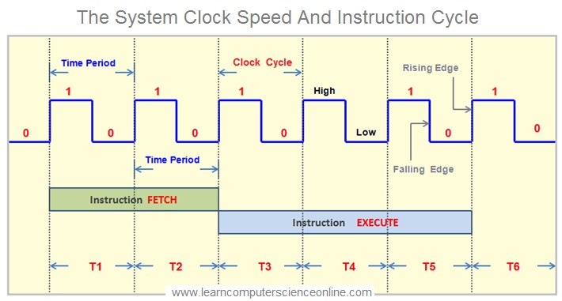
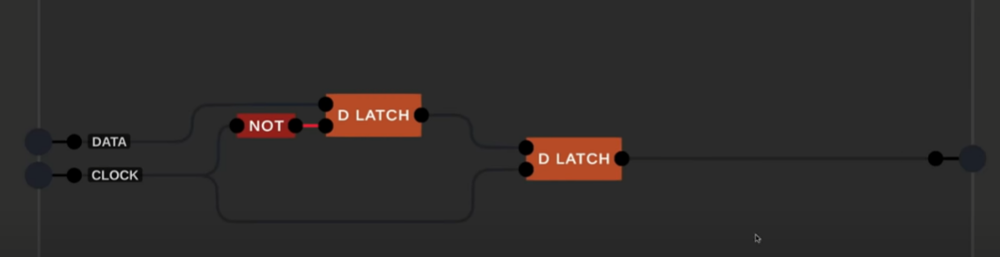

# Stellar-16

# Instruction Cycle
    - Time taken to Fetch and Execute an Instruction
    - Instruction cycle takes multiple clock cycles.
  
## Phases of Instruction Cycle:
    - Fetch: The CPU retrieves the instruction from memory.
    - Decode: The CPU decodes the instruction to determine the operation to be performed and the operands involved.
    - Execute: The CPU performs the operation specified by the instruction, which may involve arithmetic, logical, or data transfer operations.
    - Writeback: In architectures with a separate writeback phase, the CPU updates the result of the operation in the appropriate register or memory location.
  

> so.. T-states are just fancy lingo for one clock period. but it talks about the thing executed in that clock period

### Machine cycle = SUM(T states)
> Machine cycle = One phase of Instruction cycle.
> Instruction cycle = SUM(Machine cycles) = FETCH + DECODE + EXECUTE + WRITEBACK

## TRI STATE LOGIC

buses always need to be protected!

A flip-flop is a latch circuit with a “pulse detector” circuit connected to the enable (E) input, so that it is enabled only for a brief moment on either the rising or falling edge of a clock pulse.

PERSONAL NOTE : It seems this edge pulse detector is usually implemented one of two ways:
    - Electronics magic
    - Two latches Master and slave ( Example: MSDFF given below and MSJKFF )

Chip Select is just OUTPUT ENABLE. just tie a tri state buffer over it.

**Sequential Circuits (e.g., Flip-Flops, Registers):**

Write then Read: Typically, data is first written to a register or memory (e.g., during a clock edge). After writing, the data can be read in the next clock cycle. For instance, in a flip-flop, data is latched (written) on the rising edge of the clock and is then stable for reading.

**Combinational Circuits (e.g., Logic Gates, Adders):**

Read and Write Simultaneously: In purely combinational circuits, there isn't a distinct read-then-write or write-then-read process. Inputs are processed (read) simultaneously, and outputs (write) are generated instantly based on the logic.

**Memory Operations (e.g., RAM, Cache):**

Read or Write, Depending on Operation: You either perform a read or a write operation, not both simultaneously. A read operation retrieves data, while a write operation stores data.
