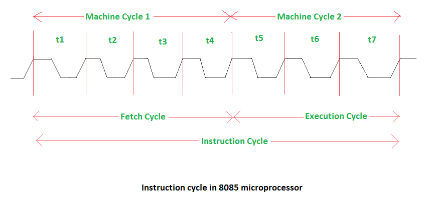
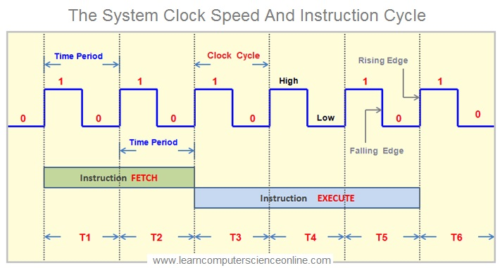
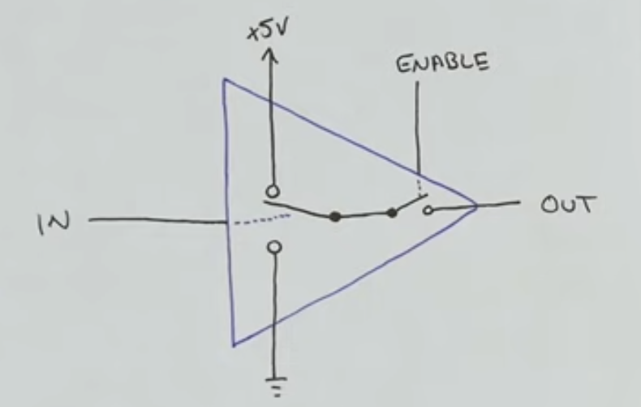

# Stellar-16

# Instruction Cycle
    - Time taken to Fetch and Execute an Instruction
    - Instruction cycle takes multiple clock cycles.
  
## Phases of Instruction Cycle:
    - Fetch: The CPU retrieves the instruction from memory.
    - Decode: The CPU decodes the instruction to determine the operation to be performed and the operands involved.
    - Execute: The CPU performs the operation specified by the instruction, which may involve arithmetic, logical, or data transfer operations.
    - Writeback: In architectures with a separate writeback phase, the CPU updates the result of the operation in the appropriate register or memory location.
  

> so.. T-states are just fancy lingo for one clock period. but it talks about the thing executed in that clock period
### Machine cycle = SUM(T states)
> Machine cycle = One phase of Instruction cycle.
> Instruction cycle = SUM(Machine cycles) = FETCH + DECODE + EXECUTE + WRITEBACK

## TRI STATE LOGIC

buses always need to be protected!