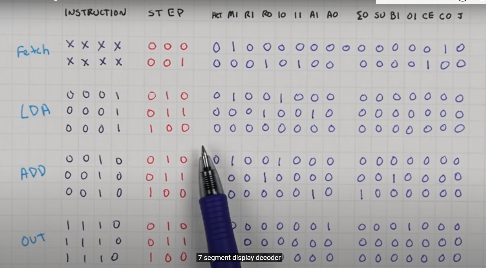
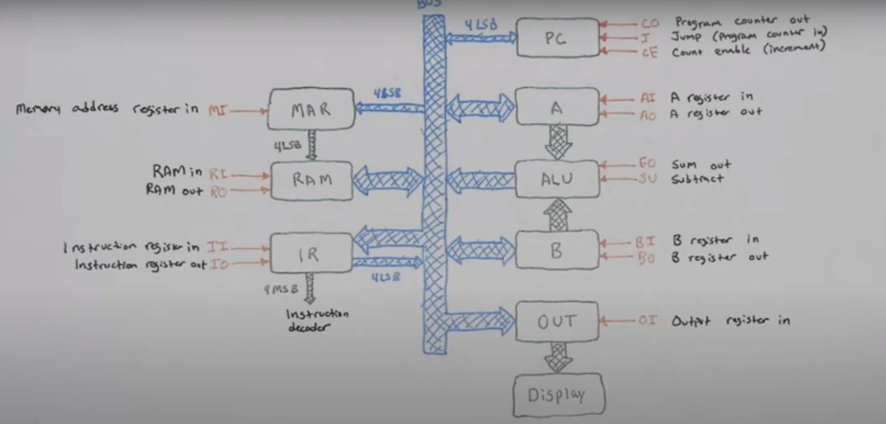
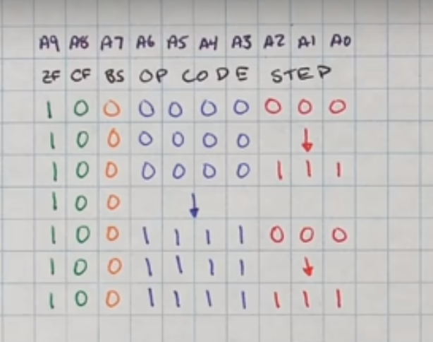
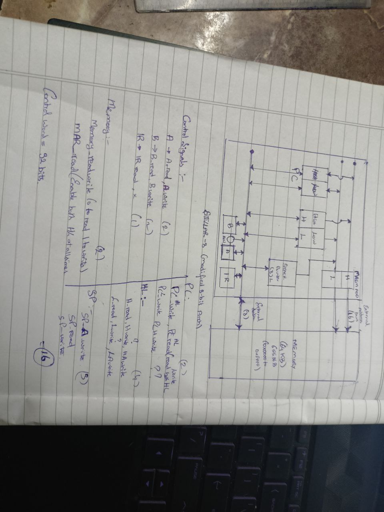

Notes :

- Combinational circuits can be easily implemented if you have memory ( Use an EEPROM - Electronically Erasable Read Only Memory )
- Each register has a Input ( Load ) and Output Enable ( say to the Bus )

- Each Opcode has tiny micro instructions in itself to do the necessary stuff.

- Once instruction is in instruction register, we need a separate counter. this counter counts which micro instruction step we are on
- Each micro instruction involves turning on the required bits in the CONTROL BLOCK using the op code and micro instruction step we are on
- CONTROL BLOCK just has enable, load and store signals that are basically synchronized with the clock to control the whole computer!

Flow of a computer: - PC : 0 - A : 0 - 4 bit address and 8 bit data.

    - MEM : 0x00      | 0x01     | 0x02  ...  0x0E  0x0F
    - DATA: LDA  0x0E | ADD 0x0F |  out  ...  0x1C  0x0E

LDA 14 # FETCH # - PC -> data bus -> MEM ( Memory now outputting lda 0x0E stored at 0x00) - MEM -> data bus -> IR -> Increment PC ( send instruction from memory to instruction register via data bus)

    # decode #
    decide the opcode and micro instructions required to carry out this instuction and run it through a decoder to get the control word info.

    # execute #
    (pass control word info to actually execute in reality.)

    since it's lda, we move data to A register
    IR (operand address) -> data bus -> MEM -> data bus -> A

    enable OUT -> enable IN via the bus (->) for all the particular registers involved at proper timings!

ADD 0x0F:
Same fetch.
PC -> data bus -> MEM -> data bus -> IR -> increment PC

    # decode ???

    # execute
    A <- A + B (temp)
    IR (operand address) -> data bus -> MEM -> data bus -> B  ( Since A and B are connected we immediately get output from ALU )
    ALU OUT -> data bus -> A

FLAG + OPCODE + STEP -> CONTROL FLAG at that step based on flag.

# TIMER

clocks/Timer give pulses of signals every specific time period.
the faster the timer the faster the computer.

