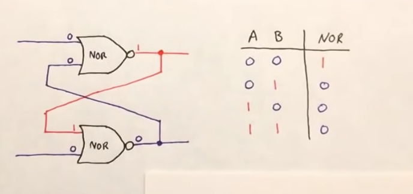
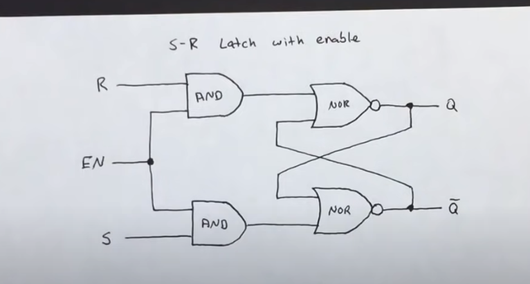
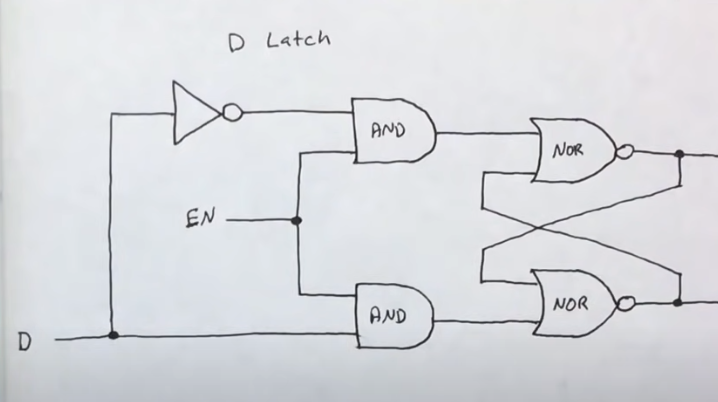
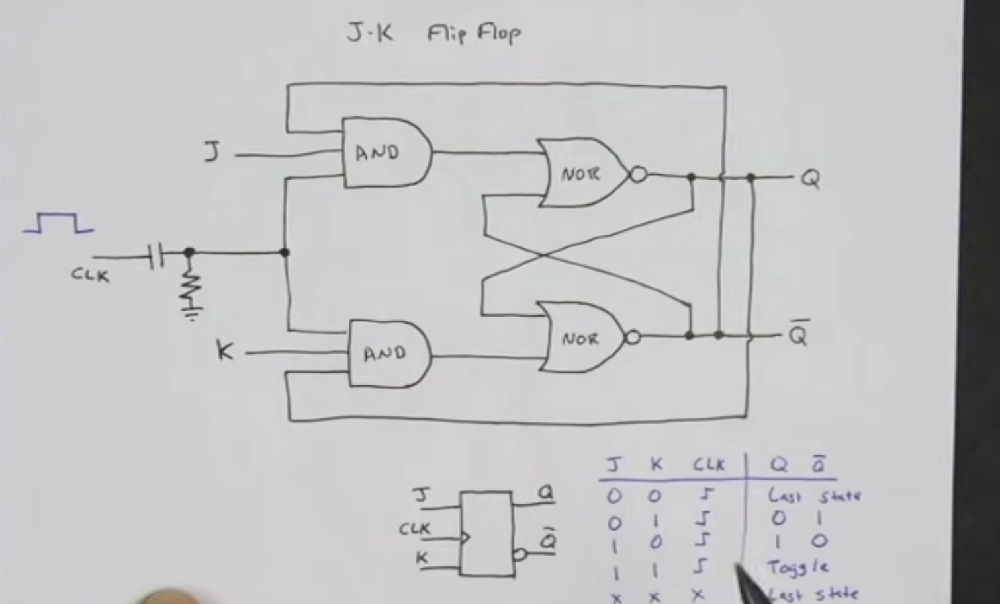
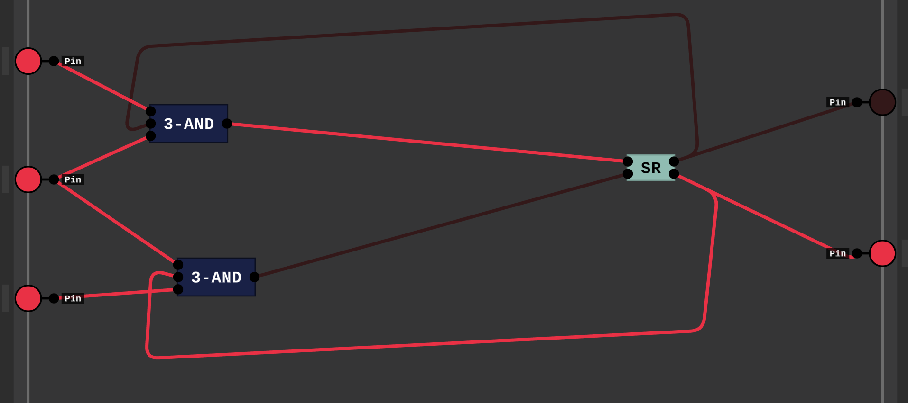
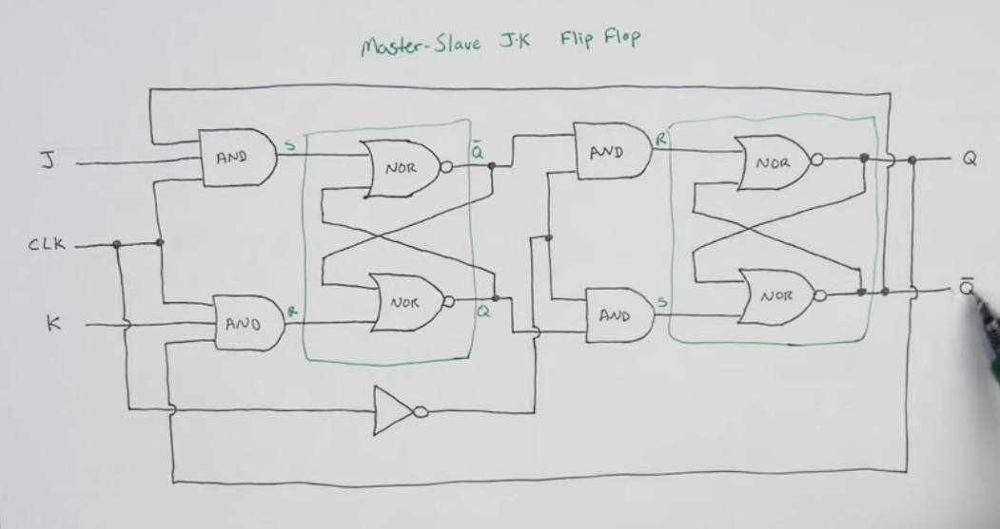
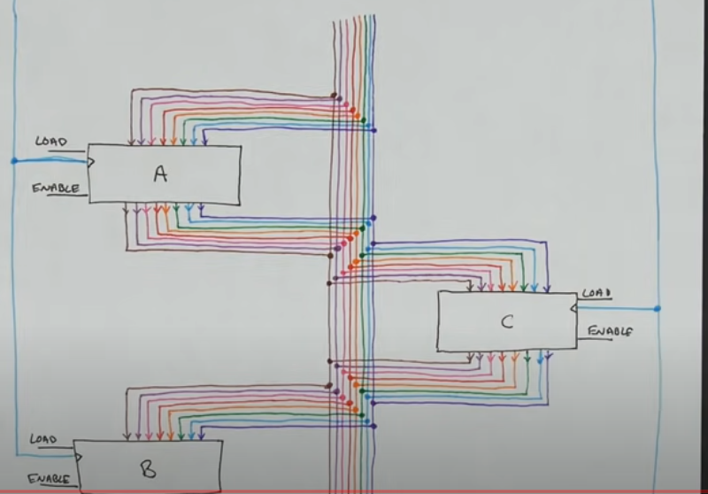
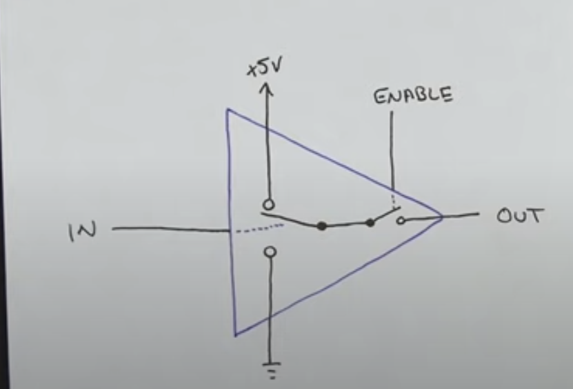
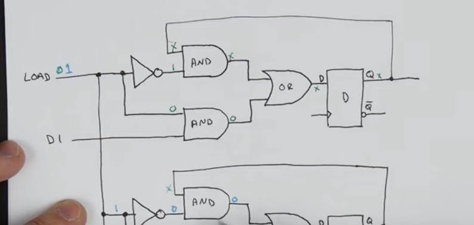
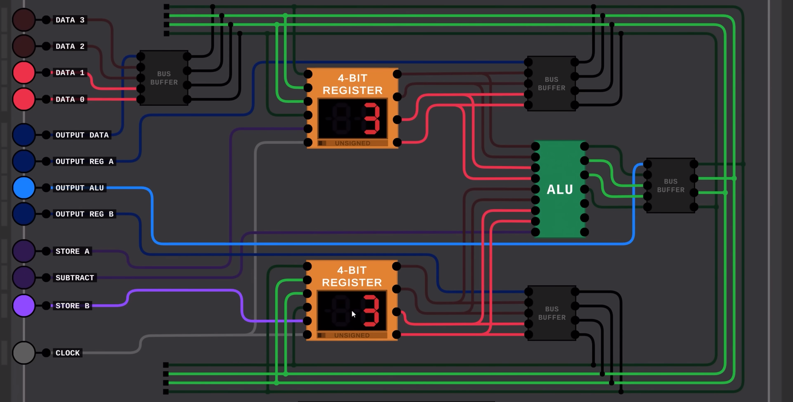

# NOR SR LATCH

# NOR SR LATCH WITH ENABLE

# D LATCH 

note : it is still Q at top and Q' at bottom

# JK FLIP FLOP

though it might look like it's not invalid. it is racing! cannot even take a screenshot cause it's racing so fast!
Note : NOR JK FLIP FLOPs require same side connection from Q AND Q' with 3 AND.
       NAND JK FLIP FLOP require opposite side flip flop with 3 NAND.

# Master slave JK FLIP FLIP

# Buses

# Tri state buffer

Suppose you just wanna turn off your output. you can do it now!
- NOTE : the three states are,
        1. ON STATE
        2. OFF STATE
        3. DISABLED STATE
    on state and off state are both information, but disabled is for safety, so we don't use it unnecessarily! 
- DO NOT INTREPRET DISABLED AS OFF STATE.

# 1 BIT REGISTER WITH LOAD AND ENABLE OUTPUT AND CLOCK

BUS BUFFER is just a tri state buffer